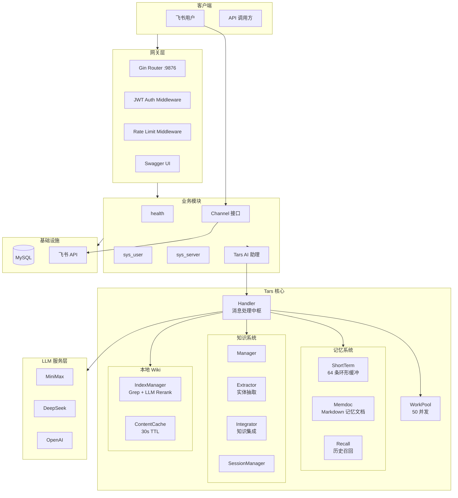
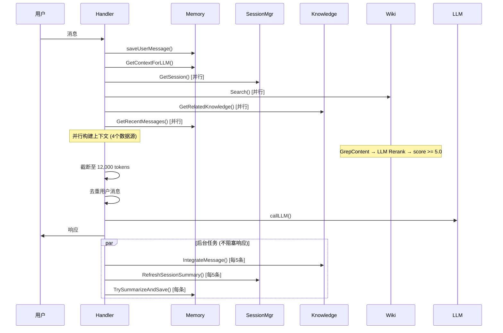

# Assistant 技术架构分析报告

> 更新时间: 2026-04-16
> 分析路径: /home/shiyi/share/github/assistant

---

## 1. 项目概述

### 1.1 项目简介

 | 项目信息   | 内容                                                               |
 | ---------- | ------                                                             |
 | 项目名称   | assistant                                                          |
 | 项目类型   | Web 服务 (RESTful API + AI 个人助理)                               |
 | 核心功能   | 个人 AI 助理（Tars）、知识图谱、本地 Wiki 搜索、分布式锁、用户管理 |
 | 定位       | 本地文档检索 + 对话记忆的智能助手                                  |

### 1.2 技术栈

 | 层级     | 技术                | 版本/说明                                 |
 | ------   | ------              | -----------                               |
 | 语言     | Go                  | 1.22+                                     |
 | 框架     | Gin                 | v1.11+                                    |
 | 数据库   | MySQL               | 8.0                                       |
 | ORM      | sqlc                | v1.30.0                                   |
 | API 文档 | Swagger             | swag v1.16.6                              |
 | 消息通道 | 飞书                | oapi-sdk-go                               |
 | LLM 支持 | 多 Provider         | DeepSeek/OpenAI/MiniMax/GLM/Gemini/Doubao |
 | 日志     | logrus + lumberjack | 日志轮转                                  |
 | 容器     | Docker              | 生产级配置                                |

### 1.3 系统规模

 | 指标       | 数值             |
 | ------     | ------           |
 | 代码行数   | ~18,000+ 行      |
 | 源文件数   | 100+ 个 .go 文件 |
 | 模块数     | 7 个业务模块     |
 | 测试文件数 | 2 个（覆盖率低） |

---

## 2. 系统架构

### 2.1 架构模式

**分层模块化架构** + **Module 注册模式**

所有业务模块实现统一接口，通过 Gin RouterGroup 注册：

```go
type Module interface {
    Name() string
    Register(r *gin.RouterGroup)
    Middleware() []gin.HandlerFunc
}
```

### 2.2 系统架构图



### 2.3 Tars 请求处理流程



---

## 3. Tars 核心模块详解

### 3.1 上下文构建管道

**正确顺序**（已修复旧版本 bug）：

```
System Prompt
  ↓
Long-term Memory (记忆文档)
  ↓
Session State (会话状态)
  ↓
Wiki (本地文档 Grep + Rerank)
  ↓
Knowledge (知识库实体)
  ↓
Conversation History (历史消息，最旧→最新)
  ↓
User Question (当前问题)
```

**关键特性**：

- 4 个数据源并行获取（`sync.WaitGroup`）
- Token 上限 12,000（从末尾截断 conversation）
- 用户消息去重（避免 ring buffer 中重复）
- 每条上下文标注 `(only use if relevant...)` 提醒 LLM 忽略无关内容

### 3.2 记忆系统

```
┌─────────────────────────────────────────┐
│           ShortTerm (内存)               │
│  64 条环形缓冲 / 按时间排序 / 最近访问更新 │
└──────────────┬──────────────────────────┘
               │
               ▼ 定期摘要 (>64 条时)
┌─────────────────────────────────────────┐
│         Memdoc (chat_memory_doc)        │
│  Markdown 格式文档 / 按 topic 累积      │
└──────────────┬──────────────────────────┘
               │
               ▼ 关键词匹配
┌─────────────────────────────────────────┐
│      Recall (chat_recall + 旧消息)      │
│  关键词搜索 → 相关旧消息 → LLM 召回     │
└─────────────────────────────────────────┘
```

**消息顺序**：数据库消息（更旧）先追加，ring buffer 消息（更新）后追加。

### 3.3 Wiki 搜索管道

```
用户查询
    │
    ▼
GrepContent()
    ├── 读取 IndexedEntry.Path
    ├── ContentCache (30s TTL, 按 ModTime 失效)
    ├── 句子边界对齐 snippet
    └── 返回 GrepHit{Entry, Snippet, Score}
    │
    ▼ (可选)
LLMReranker.Rerank()
    ├── LLM 打分 0-10
    └── 只保留 score >= 5.0 的结果
    │
    ▼
Handler 上下文组装
    └── 最多 3 条结果
```

### 3.4 知识系统

```
对话消息
    │
    ▼ ExtractEntities() [每5条]
┌─────────────────────────────────────────┐
│              Entity                     │
│  type: person/topic/concept/event       │
│  name, description, keywords            │
└──────────────┬──────────────────────────┘
               │
               ▼ ExtractRelations()
┌─────────────────────────────────────────┐
│             Relation                    │
│  from_entity → to_entity                │
│  type: related_to/depends_on/etc        │
└─────────────────────────────────────────┘
               │
               ▼ GenerateKnowledgeContent()
┌─────────────────────────────────────────┐
│          KnowledgePage                  │
│  entity_id + LLM 生成内容               │
│  单事务写入 (entity + relation + page)  │
└─────────────────────────────────────────┘
```

### 3.5 System Prompt

```markdown
You are Tars, a knowledgeable and reliable personal assistant.

Guidelines:
1. **Reasoning First**: For complex questions, think step by step.
2. **Answer Only What Was Asked**: No volunteer information.
3. **Use Context Selectively**: Ignore irrelevant context.
4. **Be Honest**: Say "I don't know" when uncertain.
5. **Be Concise**: Prefer bullet lists over paragraphs.

Communication Style:
- Use Markdown headers, bullet lists, and code blocks
- **Never use tables** - use bullet lists instead
- Be direct and brief
```

---

## 4. 数据库表结构

 | 表名                   | 用途                                         |
 | ------                 | ------                                       |
 | `chat_messages`        | 对话消息记录                                 |
 | `chat_memory_doc`      | Markdown 格式记忆文档                        |
 | `chat_session`         | 当前会话状态 (summary/context/pending_tasks) |
 | `chat_entities`        | 知识图谱实体                                 |
 | `chat_relations`       | 实体间关系                                   |
 | `chat_knowledge`       | 生成的知识页面                               |
 | `chat_recall`          | 历史召回记录                                 |
 | `chat_log`             | 操作日志                                     |
 | `sys_user`             | 用户表                                       |
 | `sys_server`           | 服务器表                                     |
 | `sys_distributed_lock` | 分布式锁表                                   |

---

## 5. 性能优化

 | 优化项                         | 效果               |
 | --------                       | ------             |
 | 4 个上下文源并行获取           | 12s → ~5s          |
 | GrepContent 内容缓存 (30s TTL) | 避免重复文件 IO    |
 | 媒体下载并行化                 | 图片+文件同时下载  |
 | Recall 关键词并行查询          | 多次 DB 查询并行化 |
 | Knowledge 关键词并行查询       | 同上               |
 | llmSemaphore 容量 5→20         | 减少后台任务排队   |
 | Token 上限 12,000              | 防止上下文溢出     |

---

## 6. 已修复问题记录

 | 问题                    | 修复方式                                               |
 | ------                  | ----------                                             |
 | 消息顺序反了 (新→旧)    | DB 消息先追加，ring buffer 后                          |
 | 用户消息重复追加        | buildContext 后去重最后一条                            |
 | 上下文组装顺序错误      | 改为 System→Memory→Session→Wiki→Knowledge→Conversation |
 | buildContext 串行获取   | 4 个 goroutine 并行执行                                |
 | GrepContent 无缓存      | 30s TTL contentCache                                   |
 | IntegrateMessage 无事务 | 单事务包裹 entity+relation+page                        |
 | llmSemaphore 容量过小   | 5 → 20                                                 |
 | goroutine context 泄漏  | 改用父 ctx                                             |
 | ShortTerm session 泄漏  | CleanupOldSessions() 每 24h 清理                       |
 | WorkPool 丢弃消息无提示 | 队列扩至 10000，超限返回 "busy"                        |

---

## 7. API 路由

 | 模块       | 方法   | 路径                                  | 说明       |
 | ------     | ------ | ------                                | ------     |
 | health     | GET    | `/health`                             | 健康检查   |
 | sys_user   | POST   | `/auth/login`                         | 用户登录   |
 | sys_user   | GET    | `/api/v1/sys_user/count`              | 用户数量   |
 | sys_user   | *      | `/api/v1/sys_user/*`                  | CRUD 操作  |
 | sys_server | *      | `/api/v1/sys_server/*`                | 服务器管理 |
 | feishu     | POST   | `/api/v1/feishu/send`                 | 发送消息   |
 | chat       | GET    | `/api/v1/chat/memory-doc/:session_id` | 记忆文档   |
 | chat       | GET    | `/api/v1/chat/messages/:session_id`   | 对话消息   |
 | chat       | GET    | `/api/v1/chat/session/:session_id`    | 会话状态   |
 | chat       | GET    | `/api/v1/chat/entities/:session_id`   | 知识实体   |
 | chat       | GET    | `/api/v1/chat/knowledge/:session_id`  | 知识页面   |

---

## 8. 配置说明

### Tars 配置

```yaml
tars:
  enabled: true
  llm_temperature: 0.7       # 回复温度
  persona:
    humor_level: 50        # 0-100
    honesty_level: 80       # 0-100
  memory:
    max_history: 64         # 短期记忆容量
    ttl_minutes: 10080       # 7天，旧消息才摘要
  wiki:
    enabled: true
    dir: ~/wiki             # 本地 markdown 目录
```

### Wiki 配置

```yaml
wiki:
  enabled: true
  dir: ~/share/github/obsidian/  # 支持 ~ 路径展开
```

Wiki 目录中的 `.md` 文件会被索引，支持中英文混合搜索。搜索时 Grep 返回匹配片段，LLM Reranker 打分，只返回相关性 >= 5.0 的结果。
