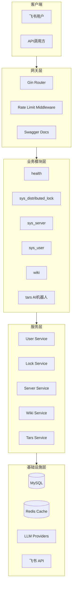

# Assistant 技术架构分析报告

> 自动生成时间: 2026-04-11
> 分析路径: /home/shiyi/share/github/assistant

---

## 1. 项目概述

### 1.1 项目简介

| 项目信息 | 内容 |
|----------|------|
| 项目名称 | assistant |
| 项目类型 | Web服务 (RESTful API + AI聊天机器人) |
| 核心功能 | 分布式锁、用户管理、AI聊天机器人（带长期记忆）、RESTful API |

### 1.2 技术栈

| 层级 | 技术 | 版本/说明 |
|------|------|-----------|
| 语言 | Go | 1.25.3 |
| 框架 | Gin | v1.11.0 |
| 数据库 | MySQL | 8.0 |
| ORM | sqlc | v1.30.0 |
| API文档 | Swagger | swag v1.16.6 |
| 消息通道 | 飞书 | oapi-sdk-go v3.5.3 |
| LLM支持 | 多Provider | DeepSeek/OpenAI/Ollama/Qwen/MiniMax/GLM/Gemini/Doubao |
| 日志 | logrus + lumberjack | 日志轮转 |
| 容器 | Docker | 生产级配置 |

### 1.3 系统规模

| 指标 | 数值 |
|------|------|
| 代码行数 | ~15,188 行 (含生成代码) |
| 源文件数 | 115 个 .go 文件 |
| 模块数 | 6 个业务模块 |
| 测试文件数 | 3 个 |
| 测试覆盖率 | 低 (<5%) |

---

## 2. 系统架构分析

### 2.1 架构模式

**识别结果:** 模块化分层架构 (Gin + Module Pattern)

**特征依据:**
- `internal/app/modules/` 下各业务模块独立
- `pkg/` 下公共组件（middleware, cache, llm, utils等）可复用
- `internal/bootstrap/` 基础设施初始化
- 使用 Module 接口统一注册路由

### 2.2 架构图



### 2.3 项目结构

```
assistant/
├── cmd/                      # 入口点
│   └── assistant/main.go
├── internal/                 # 私有应用代码
│   ├── app/
│   │   ├── modules/          # 业务模块
│   │   │   ├── health/
│   │   │   ├── sys_distributed_lock/
│   │   │   ├── sys_server/
│   │   │   ├── sys_user/
│   │   │   ├── tars/         # AI机器人核心
│   │   │   └── wiki/
│   │   ├── repo/             # 数据访问层 (sqlc生成)
│   │   └── server.go         # 服务器启动
│   └── bootstrap/            # 初始化逻辑
│       └── psl/
├── pkg/                      # 公共库
│   ├── cache/
│   ├── channel/             # 消息通道抽象
│   ├── cron/
│   ├── encrypt/
│   ├── hash/
│   ├── llm/                 # LLMProvider
│   ├── middleware/          # Gin中间件
│   ├── response/
│   ├── retry/
│   ├── smartapi/
│   ├── utils/
│   ├── xdb/                 # 数据库连接池
│   └── xlog/                # 日志
├── db/
│   ├── schema/              # SQL DDL
│   └── queries/             # sqlc查询
├── docs/                    # Swagger文档
├── config.yaml              # 配置文件
├── docker-compose.yml
├── Makefile
└── sqlc.yaml
```

### 2.4 模块划分

| 模块 | 职责 | 路由前缀 |
|------|------|----------|
| health | 健康检查 | /api/v1/health |
| sys_distributed_lock | 分布式锁管理 | /api/v1/sys_distributed_lock |
| sys_server | 服务器管理 | /api/v1/sys_server |
| sys_user | 用户管理 | /api/v1/sys_user |
| wiki | 知识库 | /api/v1/wiki |
| tars | AI聊天机器人 | /api/v1/tars |

### 2.5 服务通信方式

| 通信模式 | 使用场景 | 技术实现 |
|----------|----------|----------|
| 同步REST | 所有API | Gin HTTP |
| 数据库 | 持久化 | MySQL + sqlc |
| 缓存 | 会话/分布式锁 | Redis (via pkg/cache) |
| 消息通道 | 飞书机器人 | oapi-sdk-go |
| LLM调用 | AI对话 | 多Provider抽象 |

---

## 3. 实现分析

### 3.1 代码结构

```
internal/app/
├── server.go           # 模块注册 + 路由组织
├── modules/            # 每个模块 = handler + service + module接口
│   ├── handler.go      # HTTP处理函数
│   ├── service.go      # 业务逻辑
│   └── module.go       # 模块元信息 + 注册路由
└── repo/               # sqlc生成的数据库访问代码
```

### 3.2 设计模式使用

| 模式 | 使用场景 |
|------|----------|
| Module Pattern | 各业务模块通过统一接口注册 |
| Factory Pattern | Channel创建 (createChannel) |
| Strategy Pattern | LLM多Provider支持 |
| Repository Pattern | 数据访问层 (sqlc) |
| Middleware Pattern | Gin中间件链 |

### 3.3 代码质量

| 维度 | 评分 | 说明 |
|------|------|------|
| 命名规范 | ★★★★☆ | 良好，Go风格命名 |
| 函数长度 | ★★★★☆ | 多数函数<50行 |
| 错误处理 | ★★★☆☆ | 基本有错误处理，部分可能panic |
| 注释 | ★★★☆☆ | 有Swagger文档，代码注释少 |
| 测试覆盖 | ★★☆☆☆ | 仅3个测试文件 |

---

## 4. 技术亮点与优点

### 4.1 架构优势

1. **模块化设计良好**
   - 各业务模块独立，通过统一Module接口加载
   - 便于扩展新模块

2. **LLM Provider抽象**
   - 支持多Provider切换 (DeepSeek/OpenAI/Ollama等)
   - 便于新增Provider

3. **Channel抽象**
   - 消息通道与核心逻辑解耦
   - 目前支持飞书，易于扩展其他平台

4. **sqlc类型安全**
   - 数据库操作有编译时类型检查
   - 生成的代码质量高

5. **配置外部化**
   - 使用Viper支持YAML配置
   - 日志配置完善 (轮转、压缩)

6. **Docker生产级配置**
   - 健康检查、资源限制完善

### 4.2 技术亮点

1. **分布式锁实现** - 基于数据库的分布式锁
2. **AI短期/长期记忆** - Tars模块的memory.go实现
3. **统一响应格式** - pkg/response
4. **日志中间件** - 支持JSON格式和文件轮转

---

## 5. 缺点与潜在问题

### 5.1 P0 - 严重问题

| 问题 | 严重程度 | 说明 | 位置 |
|------|----------|------|------|
| **敏感信息硬编码** | P0 | config.yaml包含明文密码和API密钥 | config.yaml |

### 5.2 P1 - 重要问题

| 问题 | 严重程度 | 说明 | 位置 |
|------|----------|------|------|
| 硬编码localhost | P1 | 多处使用127.0.0.1默认连接 | pkg/xdb/xdb.go, pkg/llm/providers/ollama/client.go |
| 飞书密钥硬编码 | P1 | AppSecret明文在配置中 | config.yaml |
| JWT密钥弱 | P1 | `your-256-bit-secret-key-here`示例密钥 | config.yaml |
| 测试覆盖率低 | P1 | 仅3个测试文件，覆盖核心业务少 | 需增加单元测试 |

### 5.3 P2 - 一般问题

| 问题 | 说明 | 位置 |
|------|------|------|
| RateLimiter内存泄漏 | cleanup goroutine无退出机制 | pkg/middleware/ratelimit.go |
| 缺乏依赖版本约束 | go.mod未锁定关键依赖版本 | go.mod |
| 无API版本控制 | /api/v1硬编码 | internal/app/server.go |
| 错误处理不一致 | 部分使用response.Err，部分直接返回 | 各handler.go |
| 缺乏优雅关闭 | tars模块ctx可能泄漏 | internal/app/server.go |

### 5.4 P3 - 改进建议

| 问题 | 说明 |
|------|------|
| 缺乏监控埋点 | 无metrics暴露 |
| 无链路追踪 | 缺少opentelemetry |
| cron任务无统一管理 | pkg/cron独立实现 |
| 缺乏API限流细粒度控制 | 目前只有全局RateLimit |

---

## 6. 优化与改进建议

### 6.1 P0 - 立即处理

#### 敏感信息配置化

**问题描述:**
config.yaml包含明文数据库密码(AAaa00__)、JWT密钥、飞书AppSecret等敏感信息，且被提交到git。

**优化方案:**
1. 创建config.example.yaml，仅包含示例值
2. config.yaml加入.gitignore
3. 支持环境变量覆盖敏感配置
4. 使用Viper的自动环境变量绑定

**实施步骤:**
1. 创建config.example.yaml，将所有敏感值替换为占位符
2. 修改bootstrap/psl/config.go支持环境变量优先级
3. 更新.gitignore和README

**预期收益:** 消除生产密钥泄露风险

**实施难度:** 低

### 6.2 P1 - 规划处理

#### 1. RateLimiter内存泄漏修复

**问题描述:**
pkg/middleware/ratelimit.go:45 的cleanup goroutine无退出机制，应用关闭时会泄漏。

**优化方案:**
添加stop channel通知cleanup退出。

**实施步骤:**
1. 在RateLimiter结构体添加stopCh字段
2. NewRateLimiter创建stop channel
3. cleanup函数监听stop channel
4. Run函数关闭时通知cleanup退出

**预期收益:** 避免goroutine泄漏

**实施难度:** 低

#### 2. 增强测试覆盖

**问题描述:**
仅3个测试文件，核心业务逻辑（分布式锁、用户认证、Tars记忆）无测试。

**优化方案:**
按模块补充单元测试：
- sys_distributed_lock: 锁获取/释放测试
- sys_user: 登录、密码校验测试
- tars memory: 短期/长期记忆CRUD测试

**实施步骤:**
1. 为核心模块编写table-driven tests
2. 使用sqlmock测试数据库操作
3. 添加CI自动化测试

**预期收益:** 提高代码质量和重构安全性

**实施难度:** 中

#### 3. 硬编码地址配置化

**问题描述:**
pkg/xdb/xdb.go和pkg/llm/providers/ollama/client.go中localhost硬编码。

**优化方案:**
将数据库host和ollama URL纳入配置管理。

**实施步骤:**
1. 在DBPoolConfig添加Host字段
2. 在LLMConfig添加OllamaURL字段
3. 更新config.yaml

**预期收益:** 提高部署灵活性

**实施难度:** 低

### 6.3 P2 - 持续改进

#### 1. API版本控制

当前/api/v1硬编码，建议:
- 将版本号提取为常量
- 或通过X-API-Version header

#### 2. 统一错误处理

建议：
- 所有handler返回统一错误格式
- 区分业务错误和系统错误
- 添加错误码体系

#### 3. 监控与追踪

建议添加:
- Prometheus metrics端点
- OpenTelemetry链路追踪
- 健康检查增强 (db/redis/llm)

### 6.4 P3 - 未来规划

1. **微服务拆分** - 将tars模块拆分为独立服务
2. **消息队列解耦** - 使用Kafka解耦AI响应
3. **缓存优化** - Redis缓存热点数据
4. **CDN加速** - 静态资源分离

---

## 7. 结论

### 7.1 总体评价

| 维度 | 评分 | 说明 |
|------|------|------|
| 架构设计 | ★★★★☆ | 模块化良好，易扩展 |
| 代码质量 | ★★★☆☆ | 基本规范，测试不足 |
| 可维护性 | ★★★★☆ | 目录结构清晰 |
| 扩展性 | ★★★★☆ | Provider/Channel抽象好 |
| 安全性 | ★★☆☆☆ | 敏感信息硬编码严重 |
| 性能 | ★★★★☆ | 连接池、缓存基础完善 |

### 7.2 改进建议优先级

1. **P0**: 敏感信息配置化 (移除config.yaml中的明文密钥)
2. **P1**: RateLimiter内存泄漏修复
3. **P1**: 增加单元测试覆盖
4. **P1**: 配置化硬编码地址
5. **P2**: API版本控制、统一错误处理

### 7.3 长期规划建议

- 引入配置中心 (Apollo/Nacos)
- 添加完整监控体系 (Prometheus + Grafana)
- 规划微服务演进路线

---

## 附录

### A. 关键文件清单

| 文件 | 说明 |
|------|------|
| config.yaml | 应用主配置 (含敏感信息) |
| internal/app/server.go | 服务启动与模块注册 |
| internal/app/modules/tars/ | AI机器人核心模块 |
| pkg/middleware/ratelimit.go | 限流中间件 |
| pkg/llm/llm.go | LLM Provider抽象 |

### B. 依赖清单

| 依赖 | 版本 | 用途 |
|------|------|------|
| gin-gonic/gin | v1.11.0 | HTTP框架 |
| go-sql-driver/mysql | v1.8.1 | MySQL驱动 |
| golang-jwt/jwt | v5.3.1 | JWT认证 |
| larksuite/oapi-sdk-go | v3.5.3 | 飞书SDK |
| sirupsen/logrus | v1.9.3 | 日志 |
| spf13/viper | v1.20.1 | 配置管理 |
| robfig/cron | v3.0.1 | 定时任务 |
| google/uuid | v1.6.0 | UUID生成 |

### C. 检测命令记录

```bash
# 项目结构
ls -la && find . -maxdepth 3 -type d

# 代码规模
find . -name "*.go" | wc -l
find . -name "*.go" -exec wc -l {} + | tail -5

# 安全检测
grep -rn "localhost\|127\.0\.0\.1" --include="*.go"
grep -rnE "(password|secret|api.?key)" config.yaml

# 测试覆盖
find . -name "*_test.go" | wc -l
```
