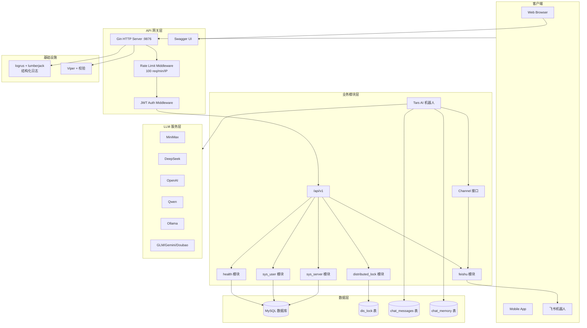

# Assistant 项目分析文档

> 更新时间: 2026-04-11
> 分析路径: /home/shiyi/share/github/assistant

---

## 一、项目概述

**项目名称**: Assistant
**技术栈**: Go 1.22 + Gin + MySQL + SQLc + Swagger
**定位**: 模块化 Web 应用，提供用户管理、分布式锁、服务器监控、LLM 集成、Tars AI 聊天机器人等功能的 RESTful API 服务。

---

## 二、系统规模

| 指标 | 数值 |
|------|------|
| 代码行数 | ~16,000+ 行 (含 docs) |
| 源文件数 | 100+ 个 .go 文件 |
| 模块数 | 6 个功能模块 |
| 依赖数量 | 约 60 个 Go 模块 |

---

## 三、架构分析

### 3.1 项目结构

```
assistant/
├── cmd/server/main.go           # 应用入口
├── internal/
│   ├── app/
│   │   ├── module/              # Module 接口定义
│   │   ├── modules/             # 功能模块
│   │   │   ├── health/          # 健康检查
│   │   │   ├── sys_user/        # 用户管理 + 认证
│   │   │   ├── sys_server/      # 服务器管理
│   │   │   └── sys_distributed_lock/  # 分布式锁
│   │   │   └── tars/           # AI 机器人 (记忆对话)
│   │   ├── repo/               # 数据库层 (SQLc 生成)
│   │   └── server.go           # Gin 服务器初始化
│   └── bootstrap/psl/           # 核心组件 (配置/DB/日志/锁/迁移)
├── pkg/
│   ├── middleware/
│   │   ├── auth.go             # JWT 认证中间件
│   │   └── ratelimit.go        # 请求限流中间件
│   ├── response/               # 统一响应结构
│   ├── cache/                 # 内存缓存 (TTL)
│   ├── hash/                  # bcrypt 密码哈希
│   ├── consts/                # 常量定义
│   ├── xdb/                   # 数据库连接池
│   ├── xlog/                  # 日志 (logrus + lumberjack)
│   ├── llm/                   # LLM 抽象层
│   │   └── providers/          # 支持 DeepSeek/OpenAI/Ollama/Qwen/MiniMax/GLM/Gemini/Doubao
│   ├── channel/               # 消息通道抽象层
│   │   ├── channel.go         # Channel 接口定义
│   │   └── feishu/            # 飞书通道实现
│   └── utils/                  # 工具函数
├── db/
│   ├── schema/                 # 数据库表结构 (6 张表)
│   └── queries/                # SQL 查询 (sqlc)
├── docs/                      # Swagger 文档
├── docker-compose.yml          # MySQL 服务
├── Dockerfile                 # 多阶段构建
├── Makefile                   # 构建自动化
└── config.yaml                # 应用配置
```

### 3.2 架构模式

**分层模块化架构** + **模块注册模式**

```go
type Module interface {
    Name() string
    Register(r *gin.RouterGroup)
    Middleware() []gin.HandlerFunc
}
```

### 3.3 启动流程

```
InitConfig() → InitLog() → InitDB() → InitDisLocker()
→ MigrateDB() → EnsureLocalSysServerRegistered() → app.Run()
```

### 3.4 服务通信方式

| 通信模式 | 使用场景 | 技术实现 |
|----------|----------|----------|
| 同步 REST | 所有业务接口 | Gin HTTP |
| Channel 接口 | 消息收发 | 抽象接口 (Feishu 实现) |
| LLM API | AI 对话 | HTTP REST (多 Provider) |
| 限流 | API 保护 | 令牌桶算法 (IP 级别) |

---

## 四、功能特性

### 4.1 核心模块

| 模块 | 说明 |
|------|------|
| **health** | 健康检查，支持多依赖检查 |
| **sys_user** | 用户管理，JWT 认证，bcrypt 密码 |
| **sys_server** | 服务器注册与监控，CPU/内存上报 |
| **sys_distributed_lock** | 分布式锁，DB 实现，TTL 支持 |
| **tars** | AI 聊天机器人，双层记忆系统 |

### 4.2 Tars AI 机器人

**特性**:
- **Channel 抽象层**: 支持多消息平台（当前仅 Feishu）
- **短期记忆**: 内存缓存，默认 30 条消息
- **长期记忆**: LLM 提取关键词 + 生成摘要，存数据库
- **Markdown 回复**: 支持 Markdown 格式输出
- **自动清理**: 90 天前的历史数据自动删除

**记忆架构**:
```
用户消息 → 存入 DB → 加入短期记忆
    ↓
提取关键词 (LLM，30秒缓存)
    ↓
搜索历史摘要 → 组合上下文
    ↓
LLM 生成回复 → 存入 DB → 更新短期记忆
    ↓
定期摘要旧对话 → 生成摘要存入 chat_memory
```

### 4.3 Channel 接口

```go
type Channel interface {
    Name() string
    SendMessage(ctx context.Context, chatID, msgType, content string) error
    StartListening(ctx context.Context) error
    SetMessageHandler(handler MessageHandler)
}
```

---

## 五、数据库设计

### 5.1 表结构 (6 张)

| 表名 | 说明 |
|------|------|
| `sys_user` | 用户表 |
| `sys_server` | 服务器表 |
| `sys_distributed_lock` | 分布式锁表 |
| `chat_messages` | 对话消息记录表 |
| `chat_memory` | 对话长期记忆摘要表 |

### 5.2 核心表结构

**chat_messages (对话消息记录表)**
```sql
chat_id, open_id, username, role, content, message_id, created_at
```

**chat_memory (对话长期记忆摘要表)**
```sql
chat_id, keyword, summary, start_time, end_time, message_count, created_at
```

---

## 六、工程化

| 特性 | 说明 |
|------|------|
| **Makefile** | 精简版，约 55 行，包含 build/test/lint/docker |
| **Swagger** | API 自动文档生成 |
| **Docker** | 多阶段构建 + docker-compose |
| **日志** | logrus + lumberjack，结构化输出 |
| **数据库迁移** | 自定义迁移系统 |
| **SQLc** | 类型安全的数据库代码生成 |

---

## 七、安全性

- **JWT 认证**: 所有业务接口需认证
- **密码加密**: bcrypt 存储 (cost=12)
- **公开接口**: `/auth/login` 和 `/health` 公开
- **SQL 注入防护**: SQLc 参数化查询
- **请求限流**: 令牌桶算法，100 req/min/IP

---

## 八、接口清单

### 8.1 公开接口 (无需认证)

| 方法 | 路径 | 说明 |
|------|------|------|
| POST | `/auth/login` | 用户登录，获取 JWT Token |
| GET | `/health` | 健康检查 |

### 8.2 需认证接口 (Header: `Authorization: Bearer <token>`)

| 模块 | 方法 | 路径 | 说明 |
|------|------|------|------|
| sys_user | GET | `/api/v1/sys_user/count` | 用户数量统计 |
| sys_user | POST | `/api/v1/sys_user/create` | 创建用户 |
| sys_user | DELETE | `/api/v1/sys_user/delete/:id` | 删除用户 |
| sys_user | GET | `/api/v1/sys_user/get/:id` | 获取用户详情 |
| sys_user | GET | `/api/v1/sys_user/list` | 用户列表 (分页) |
| sys_user | POST | `/api/v1/sys_user/search_by_email` | 按邮箱搜索 |
| sys_user | POST | `/api/v1/sys_user/search_by_user_name` | 按用户名搜索 |
| sys_user | PUT | `/api/v1/sys_user/update/:id` | 更新用户 |
| sys_server | * | `/api/v1/sys_server/*` | 服务器管理 |
| sys_distributed_lock | * | `/api/v1/sys_distributed_lock/*` | 分布式锁操作 |
| feishu | POST | `/api/v1/feishu/send` | 发送飞书消息 |

---

## 九、架构图

### 9.1 系统架构图



### 9.2 模块依赖关系

```mermaid
flowchart LR
    subgraph Entry["入口"]
        main[main.go]
    end

    subgraph Bootstrap["启动层"]
        config[配置加载 + 校验]
        db[数据库连接]
        logger[日志初始化]
        dislock[分布式锁]
    end

    subgraph Server["服务层"]
        server[app.Run]
    end

    subgraph Middleware["中间件层"]
        rate[RateLimit<br/>100 req/min]
        auth[JWTAuth]
    end

    subgraph Modules["业务模块"]
        health[health]
        sys_user[sys_user]
        sys_server[sys_server]
        dislock_mod[distributed_lock]
        feishu[feishu]
        tars[tars]
    end

    main --> Bootstrap
    Bootstrap --> server
    server --> Middleware
    Middleware --> Modules
```



---

## 十、代码质量评分

| 维度 | 评分 | 说明 |
|------|------|------|
| **架构设计** | ⭐⭐⭐⭐ | 模块化清晰，Channel 抽象扩展性好 |
| **代码质量** | ⭐⭐⭐ | 结构合理 |
| **工程化** | ⭐⭐⭐⭐⭐ | Makefile 精简，Docker 支持完整 |
| **安全性** | ⭐⭐⭐⭐ | JWT + bcrypt + 限流 |
| **可维护性** | ⭐⭐⭐⭐ | 代码组织良好 |

---

## 十一、总结

### 11.1 优势

- 项目基础架构扎实，模块化设计合理
- Channel 抽象层支持多消息平台扩展
- 核心功能（认证、分布式锁、健康检查）完整实现
- Tars 聊天机器人具有双层记忆系统
- 工程化程度高，Docker、Makefile、Swagger 支持完善
- LLM 抽象层支持多 Provider，便于切换

### 11.2 待改进

- 测试覆盖率低
- 敏感信息建议使用环境变量或密钥服务管理
